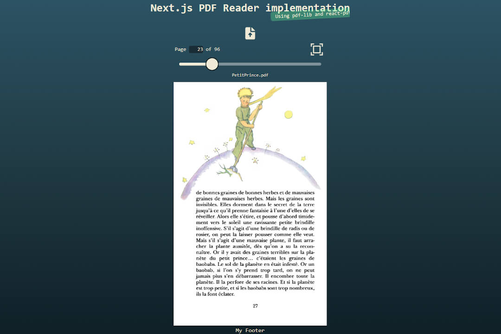
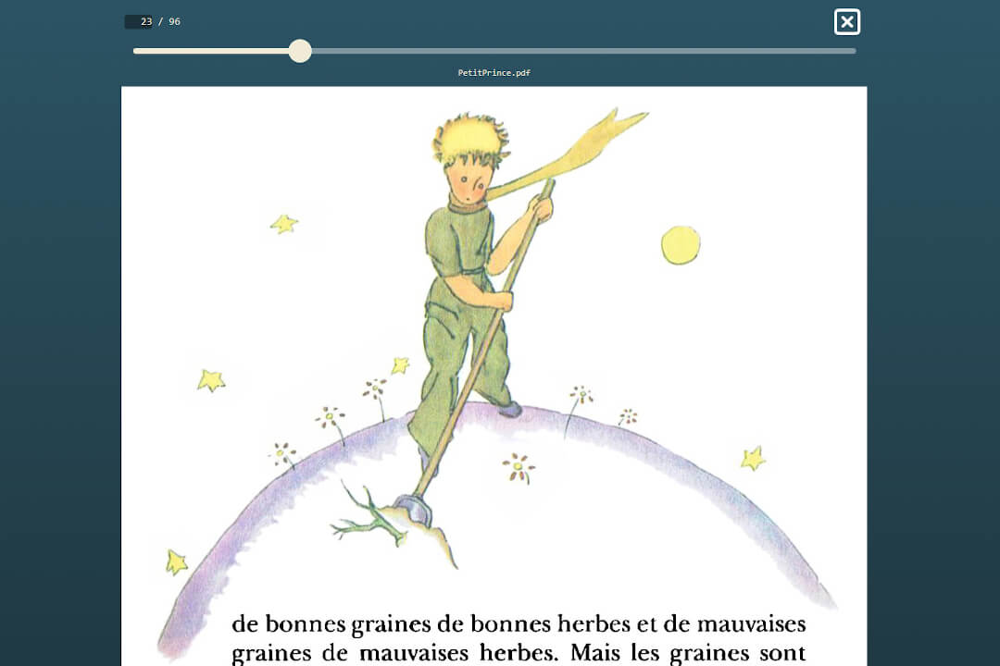

# Next.js PDF Reader Implementation with pdf-lib and react-pdf

PDF Reader implementation for the Next.js framework using the PDF libraries pdf-lib (for reading the PDF and converting it into a bytestream) and react-pdf (for displaying the PDF document on the screen).



In normal mode, the PDF automatically adapts to the viewport (taking the aspect ratio into account); in full-screen mode, the PDF is enlarged to the available screen width and the page can be scrolled upwards.



The React component library react-aria is used to open the PDF file on the device and to move the mouse or pointer. After loading the website, you can click on the upload button and (for the purpose of illustration) upload a PDF from the device to the page. In the real world, the PDF page would actually be retrieved by a content provider.

## Tech Stack

- Next.js@14.2
- [pdf-lib](https://pdf-lib.js.org/)
- [react-pdf](https://react-pdf.org/)
- [react-aria](https://react-spectrum.adobe.com/react-aria/)
- Tailwind CSS

## Demo version deployed on a WebContainer in Stackblitz

A demo version is deployed on Stackblitz [Link](https://stackblitz.com/~/github.com/tuedodev/pdf-reader-implementation-with-pdf-lib-and-react-pdf?file=README.md). Click on the upload button, load a PDF file from your gadget and you are good to go.

## Getting Started

This is a [Next.js](https://nextjs.org/) project bootstrapped with [`create-next-app`](https://github.com/vercel/next.js/tree/canary/packages/create-next-app).

### Customize Settings

You can adjust your settings (expiring dates of the session token and magic links in seconds) to your requirements at `@/lib/constants.ts`

```typescript
export const MAXIMAL_NUMBER_OF_PUBLIC_PAGES = 9999;
/* For each PDF document, you can specify how many pages are freely accessible to the public (as an appetizer), 
the rest can then be made accessible via a payment barrier. This value is best stored as a value together with 
the document at a content provider or in a database. */

export const MOVEMENT_VELOCITY = 0.5;
/* Specifies the vertical acceleration factor of the mouse or pointer when sliding the pages. Value between 0 and 
1. A lower value slows down the acceleration, a higher value speeds it up.*/

export const MOVEMENT_THRESHOLD = 1;
/* Specifies the threshold in pixels that the mouse or pointer must move in order to trigger a slide.*/
```

### Start Development Server

Run the development server:

```bash
npm run dev
# or
yarn dev
# or
pnpm dev
# or
bun dev
```

Open [http://localhost:3000](http://localhost:3000) with your browser to see the result.

## Learn More

To learn more about Next.js, take a look at the following resources:

- [Next.js Documentation](https://nextjs.org/docs) - learn about Next.js features and API.
- [Learn Next.js](https://nextjs.org/learn) - an interactive Next.js tutorial.

You can check out [the Next.js GitHub repository](https://github.com/vercel/next.js/) - your feedback and contributions are welcome!

## Deploy on Vercel

The easiest way to deploy your Next.js app is to use the [Vercel Platform](https://vercel.com/new?utm_medium=default-template&filter=next.js&utm_source=create-next-app&utm_campaign=create-next-app-readme) from the creators of Next.js.

Check out our [Next.js deployment documentation](https://nextjs.org/docs/deployment) for more details.
